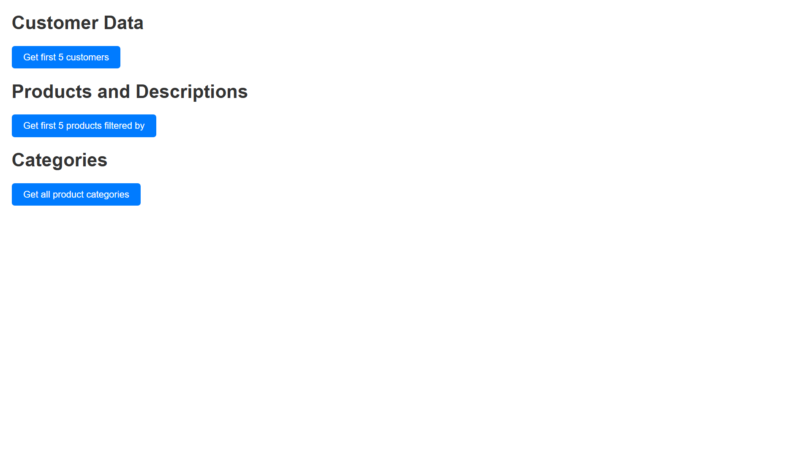

# Build a data app using Fabric API for GraphQL

This project is a sample implementation of a using [Fabric API for GraphQL](https://learn.microsoft.com/fabric/data-engineering/api-graphql-overview) with a Flask Application to get data from Fabric SQL database.



## Pre-requisites

-[Setup Fabric API for Graphql](https://learn.microsoft.com/en-us/fabric/data-engineering/get-started-api-graphql)
- [Setup Fabric SQL Database with sample](https://learn.microsoft.com/en-us/fabric/database/sql/tutorial-ingest-data)
- [Python 3.11](https://www.python.org/downloads/release/python-3110/)
- [Create Service principal(SPN) for Microsoft Fabric](https://www.youtube.com/watch?v=_RXpvWjgZE8)

## Installation

1. Clone the repository:
    ```sh
    git clone https://github.com/yourusername/python-graphql-sample.git
    cd python-graphql-sample
    ```

2. Create and activate a virtual environment (optional but recommended):
    ```sh
    python -m venv venv
    source venv/bin/activate  # On Windows use `venv\Scripts\activate`
    ```

3. Install the dependencies:
    ```sh
    pip install -r requirements.txt
    ```

## Usage

1. Start the GraphQL server:
    ```sh
    python app.py
    ```

2. Open your browser and navigate to `http://localhost:5000/api/gql` to access the GraphQL playground.

## Example Queries

Here are some example queries you can run in the GraphQL playground:

### Query
```graphql
query{
            customers(first: 5) {
               items {
                  CustomerID
                  FirstName
                  LastName
                  EmailAddress         
               }
            }
            vProductAndDescriptions {
               items {
                  ProductID
                  Name
                  Description
                  ProductModel       
               }
            }
            vGetAllCategories {
               items {
                  ProductCategoryID
                  ParentProductCategoryName
                  ProductCategoryName
               }
            }
         }
```

### Mutation
```graphql
mutation {
  createItem(name: "Sample Item", description: "This is a sample item") {
    id
    name
    description
  }
}
```

## Deploy the app
1. Install Azure CLI to deploy the app to azure. If you dont have an Azure subscription, try fo free. 
2. Run ```az webapp up``` to deploy the app to Azure Web Apps.  Note the resource group being created.
3. Login into the Azure portal and open the newly created resource group. 
4. Select the web app resource created and browse the application

If you run into any issues , check **Application logs** in **Diagnose and solve**. 

## Contributing

Contributions are welcome! Please open an issue or submit a pull request for any changes.

## License

This project is licensed under the MIT License. See the [LICENSE](LICENSE) file for details.


